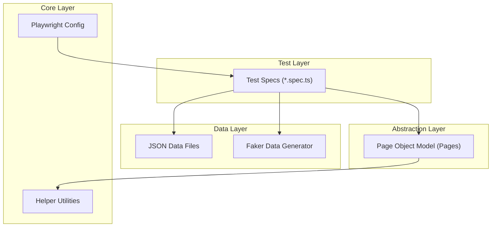

# ITI Graduation Project: Personal E-Commerce Automation

**Author:** Mohamed Ahmed Gomaa  
**Institution:** Information Technology Institute (ITI)  
**Target Website:** [https://itigraduation.pythonanywhere.com](https://itigraduation.pythonanywhere.com)

## 📌 Project Overview

This project is a comprehensive **End-to-End (E2E) Test Automation Framework** for a personal e-commerce website. It is built using **Playwright** and **TypeScript**, designed to ensure the quality and reliability of critical user journeys such as User Authentication, Product Discovery, Shopping Cart Management, and Order Processing.

The framework demonstrates advanced automation concepts including the Page Object Model (POM), Data-Driven Testing, and parallel execution, serving as a robust example of modern web testing practices.

## 📸 Project Tour & UI Walkthrough

Below is a visual walkthrough of the application flow, from the landing page to product management.

### User Interface & Navigation
| | |
|:---:|:---:|
|  |  |
|  |  |
|  |  |

### Product Details & Cart Flow
| | |
|:---:|:---:|
|  |  |
|  |  |

### Admin & Backend Functionality
| | |
|:---:|:---:|
|  |  |
|  |  |

### Additional Views
| | |
|:---:|:---:|
|  |  |
|  | |

---

## 🛠️ Technology Stack

| Component | Technology |
|-----------|------------|
| **Automation Tool** | [Playwright](https://playwright.dev/) |
| **Language** | [TypeScript](https://www.typescriptlang.org/) |
| **Runtime** | [Node.js](https://nodejs.org/) |
| **Reporting** | Playwright HTML Report, [Monocart Reporter](https://github.com/cenfun/monocart-reporter) |
| **Data Generation** | [Faker.js](https://fakerjs.dev/) |
| **CI/CD** | (Ready for integration) |

## 🏗️ Architecture & Design Patterns

This project adheres to industry best practices to ensure scalability and maintainability.



### Key Design Patterns Implemented:
1.  **Page Object Model (POM):** Encapsulates page-specific elements and actions into separate classes (e.g., `LoginPage`, `CartPage`), promoting code reuse and reducing maintenance.
2.  **Data-Driven Testing:** Utilizes external JSON files (e.g., `users.json`) to drive tests with various data sets, ensuring broad coverage.
3.  **Auto-Waiting:** Leverages Playwright's built-in auto-waiting mechanisms to handle dynamic content reliability without hard-coded sleeps.
4.  **Parallel Execution:** Configured to run tests across **4 workers** simultaneously, significantly reducing execution time.
5.  **Robust Locators:** Prioritizes user-facing locators (Role, Text, Label) and Accessibility IDs over brittle XPath or CSS selectors.
6.  **Reusable Utilities:** Common functions are abstracted into utility classes for consistency.

## 🚀 Setup & Usage

### Prerequisites
-   **Node.js** (v14 or higher)
-   **npm** (Node Package Manager)

### Installation
1.  Clone the repository:
    ```bash
    git clone <repository-url>
    ```
2.  Navigate to the project directory:
    ```bash
    cd playwright-tests3
    ```
3.  Install dependencies:
    ```bash
    npm install
    ```
4.  Install Playwright browsers:
    ```bash
    npx playwright install
    ```

### Running Tests
The project includes several npm scripts for convenience (defined in `package.json`):

| Command | Description |
|---------|-------------|
| `npm test` | Run all tests in headless mode. |
| `npm run test:headed` | Run all tests in headed mode (visible browser). |
| `npm run test:register` | Run only Registration tests. |
| `npm run test:login` | Run only Login tests. |
| `npm run test:products` | Run only Product tests. |
| `npm run report` | Open the HTML test report. |
| `npm run test:debug` | Run tests in debug mode. |

## 📊 Test Coverage & Reports

The framework utilizes both the standard Playwright HTML Reporter and the Monocart Reporter for detailed insights.

-   **Test Traces:** Full execution traces are captured for failed tests.
-   **Videos:** Video recordings of test execution are available in the reports.
-   **Screenshots:** Captured automatically on failure.

### Complete Test Case Coverage

This automation framework covers **114 test cases** across 5 major modules. Below is the complete test case inventory:

#### 🔐 Authentication Tests (AuthTests)

| Test ID | User Story | Test Title | Pre-condition | Expected Result |
|---------|------------|------------|---------------|-----------------|
| **AT-TC-001** | US-UI-001 | Verify Register page loads correctly | User is on the registration page | User is redirected to the login page or a success message is displayed |
| **AT-TC-002** | US-UI-001 | Verify registration with existing email fails | User is on the registration page | An error message is displayed indicating that the email is already in use |
| **AT-TC-003** | US-UI-001 | Verify registration with invalid email fails | User is on the registration page | An error message is displayed for the invalid email format |
| **AT-TC-004** | US-UI-001 | Verify registration with mismatched passwords fails | User is on the registration page | An error message is displayed indicating that the passwords do not match |
| **AT-TC-005** | US-UI-001 | Verify registration functionality (password < 6 chars) | User is on the registration page | An error message is displayed for invalid password length |
| **AT-TC-006** | US-UI-001 | Verify registration functionality (password without numbers) | User is on the registration page | An error message is displayed indicating that the password must contain at least one number |
| **AT-TC-007** | US-UI-001 | Verify registration functionality (password without letters) | User is on the registration page | An error message is displayed indicating that the password must contain at least one letter |
| **AT-TC-008** | US-UI-002 | Verify successful login | User has a valid account | User is redirected to the home page or their dashboard |
| **AT-TC-009** | US-UI-002 | Verify login with incorrect password | User has a valid account | An error message is displayed for invalid credentials |
| **AT-TC-010** | US-UI-002 | Verify login with unregistered email | User is on the login page | An error message is displayed for invalid credentials |
| **AT-TC-011** | US-UI-002 | Verify login with empty email field fails | User is on the login page | An error message is displayed for the empty email field |
| **AT-TC-012** | US-UI-002 | Verify login with empty password field fails | User is on the login page | An error message is displayed for the empty password field |
| **AT-TC-013** | US-UI-002 | Verify login with empty email and password fails | User is on the login page | An error message is displayed for empty credentials |
| **AT-TC-014** | US-UI-002 | Verify login functionality (password 5 chars) | User is on the login page | An error message is displayed for invalid password length |
| **AT-TC-015** | US-UI-002 | Verify login functionality (password 6 chars - min) | User is on the login page | User is redirected to the home page or their dashboard |
| **AT-TC-016** | US-UI-002 | Verify login functionality (password 20 chars - max) | User is on the login page | User is redirected to the home page or their dashboard |
| **AT-TC-017** | US-UI-002 | Verify login functionality (password 21 chars) | User is on the login page | An error message is displayed for invalid password length |
| **AT-TC-018** | US-UI-003 | Verify successful user logout | User is logged in | User is logged out and redirected to the home page |

#### 🛍️ Product Tests (ProductTests)

| Test ID | User Story | Test Title | Pre-condition | Expected Result |
|---------|------------|------------|---------------|-----------------|
| **PT-TC-001** | US-UI-004 | View products list | N/A | A list of products is displayed, each with a name, image, and price |
| **PT-TC-002** | US-UI-005 | View product details | Products are available | The user is redirected to the product detail page, showing more information about the product |
| **PT-TC-003** | US-UI-006 | Search for a product | Products are available | Products matching the search term are displayed |
| **PT-TC-004** | US-UI-006 | Search for a non-existent product | Products are available | A message indicating 'No products found' is displayed |
| **PT-TC-005** | US-UI-007 | Verify product filter functionality (category) | Products are available | Only products belonging to the selected category are displayed |
| **PT-TC-006** | US-UI-007 | Verify product filter functionality (price range) | Products are available | Only products within the selected price range are displayed |
| **PT-TC-007** | US-UI-017 | Verify product pagination | Products are displayed across multiple pages | The corresponding page of products is displayed |
| **PT-TC-008** | US-UI-018 | Verify like product functionality | User is logged in and is on a product page | The like count for the product increases |
| **PT-TC-009** | US-UI-018 | Verify unlike product functionality | User has liked a product | The like count for the product decreases |

#### 🛒 Cart Tests (CartTests)

| Test ID | User Story | Test Title | Pre-condition | Expected Result |
|---------|------------|------------|---------------|-----------------|
| **CT-TC-001** | US-UI-008 | Verify guest can't access cart page | User is not logged in | See alert message 'Please login to continue' or similar login requirement message |
| **CT-TC-002** | US-UI-009 | Verify users can add products to cart | User is logged in and navigates to cart | See 'Added to cart!' alert and cart badge increment |
| **CT-TC-003** | US-UI-010 | Verify logged-in user can see empty cart state | User is logged in and navigates to cart | See 'Your cart is empty' label, Total: $0.00, Subtotal: $0.00, and available buttons |
| **CT-TC-004** | US-UI-011 | Verify logged-in user can add products and see them in cart | User is logged in | See product in cart with name, price, quantity, item total and correct calculations |
| **CT-TC-005** | US-UI-025 | Verify user can increase item quantity and calculations update | User has items in cart | Item quantity increases, item total recalculates, cart subtotal and total update |
| **CT-TC-006** | - | Verify user can decrease item quantity and calculations update | User has items in cart with quantity > 1 | Item quantity decreases, item total recalculates, cart subtotal and total update |
| **CT-TC-007** | - | Verify user can set specific quantity and calculations update | User has items in cart | Item quantity updates, item total recalculates, cart subtotal and total update |
| **CT-TC-008** | - | Verify user can remove individual items from cart | User has multiple items in cart | Selected item disappears, cart badge and calculations update accordingly |
| **CT-TC-009** | - | Verify user can clear all items from cart | User has items in cart | Cart becomes empty with appropriate empty state messages |
| **CT-TC-010** | - | Verify all monetary values follow $XX.XX format | User has items in cart | All prices, item totals, subtotal and total follow $XX.XX format with 2 decimal places |
| **CT-TC-011** | - | Verify checkout process works when cart has items | User has items in cart and is logged in | Shipping address field accepts and retains the entered address |
| **CT-TC-012** | - | Verify user can't checkout with empty shipping address | User is on checkout page | User can't checkout with empty address |
| **CT-TC-013** | - | Verify system handles invalid zero quantities | User has items in cart | System handles invalid input and remove item from cart |
| **CT-TC-014** | - | Verify system handles invalid negative quantities | User has items in cart | System handles invalid input and remove item from cart |
| **CT-TC-015** | - | Verify system handles invalid 999999 quantities | User has items in cart | Alert message appears: insufficient stock |
| **CT-TC-016** | - | Verify cart state persists after navigation | User has items in cart | Cart contents and calculations remain unchanged after navigation |

#### 📦 Order Tests (OrderTests)

| Test ID | User Story | Test Title | Pre-condition | Expected Result |
|---------|------------|------------|---------------|-----------------|
| **OT-TC-001** | US-UI-012 | Verify product checkout | User has items in the cart | The user is redirected to the order page |
| **OT-TC-002** | US-UI-013 | Place order with valid shipping information | User is on the checkout page | An order confirmation message is displayed, and the order appears in the user's order history |
| **OT-TC-003** | US-UI-013 | Place order with empty shipping address | User is on the checkout page | An error message is displayed, prompting the user to fill in the shipping address |
| **OT-TC-004** | US-UI-014 | View order history | User is logged in and has placed orders | A list of the user's past orders is displayed |
| **OT-TC-005** | US-UI-026 | Filter orders by status | User has placed orders with different statuses | Only orders with the selected status are displayed |
| **OT-TC-006** | US-UI-027 | Cancel pending order | User has a pending order | The order status changes to 'cancelled' |
| **OT-TC-007** | US-UI-030 | Buy Now functionality | User is on a product page | The user is taken directly to the checkout page with the item in their cart |

#### 🔍 Advanced Search Tests (AdvancedSearchTests)

| Test ID | User Story | Test Title | Pre-condition | Expected Result |
|---------|------------|------------|---------------|-----------------|
| **AST-TC-001** | US-UI-033 | Complete Advanced Search Form | N/A | Products matching the criteria are displayed |
| **AST-TC-002** | US-UI-033 | Clear Advanced Search Form | N/A | Products should clear |

## 📸 Visuals

### Website Preview
> *[Placeholder: Insert screenshot of the Home Page here]*

### Test Report Example
> *[Placeholder: Insert screenshot of the Monocart Report Dashboard here]*

---
**© 2025 Mohamed Ahmed Gomaa** | ITI Graduation Project
