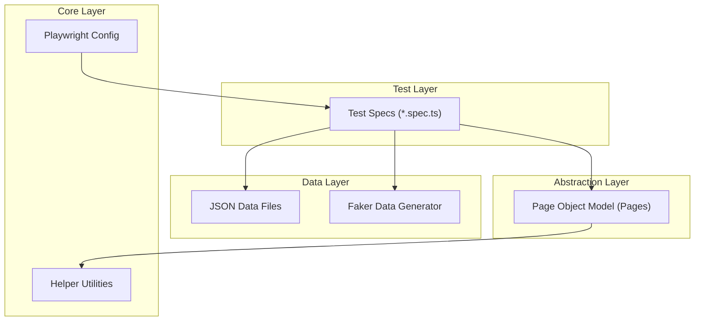

# ITI Graduation Project: Personal E-Commerce Automation

**Author:** Mohamed Ahmed Gomaa  
**Institution:** Information Technology Institute (ITI)  
**Target Website:** [https://itigraduation.pythonanywhere.com](https://itigraduation.pythonanywhere.com)

## 📌 Project Overview

This project is a comprehensive **End-to-End (E2E) Test Automation Framework** for a personal e-commerce website. It is built using **Playwright** and **TypeScript**, designed to ensure the quality and reliability of critical user journeys such as User Authentication, Product Discovery, Shopping Cart Management, and Order Processing.

The framework demonstrates advanced automation concepts including the Page Object Model (POM), Data-Driven Testing, and parallel execution, serving as a robust example of modern web testing practices.

## 🛠️ Technology Stack

| Component | Technology |
|-----------|------------|
| **Automation Tool** | [Playwright](https://playwright.dev/) |
| **Language** | [TypeScript](https://www.typescriptlang.org/) |
| **Runtime** | [Node.js](https://nodejs.org/) |
| **Reporting** | Playwright HTML Report, [Monocart Reporter](https://github.com/cenfun/monocart-reporter) |
| **Data Generation** | [Faker.js](https://fakerjs.dev/) |
| **CI/CD** | (Ready for integration) |

## 🏗️ Architecture & Design Patterns

This project adheres to industry best practices to ensure scalability and maintainability.



### Key Design Patterns Implemented:
1.  **Page Object Model (POM):** Encapsulates page-specific elements and actions into separate classes (e.g., `LoginPage`, `CartPage`), promoting code reuse and reducing maintenance.
2.  **Data-Driven Testing:** Utilizes external JSON files (e.g., `users.json`) to drive tests with various data sets, ensuring broad coverage.
3.  **Auto-Waiting:** Leverages Playwright's built-in auto-waiting mechanisms to handle dynamic content reliability without hard-coded sleeps.
4.  **Parallel Execution:** Configured to run tests across **4 workers** simultaneously, significantly reducing execution time.
5.  **Robust Locators:** Prioritizes user-facing locators (Role, Text, Label) and Accessibility IDs over brittle XPath or CSS selectors.
6.  **Reusable Utilities:** Common functions are abstracted into utility classes for consistency.

## 🚀 Setup & Usage

### Prerequisites
-   **Node.js** (v14 or higher)
-   **npm** (Node Package Manager)

### Installation
1.  Clone the repository:
    ```bash
    git clone <repository-url>
    ```
2.  Navigate to the project directory:
    ```bash
    cd playwright-tests3
    ```
3.  Install dependencies:
    ```bash
    npm install
    ```
4.  Install Playwright browsers:
    ```bash
    npx playwright install
    ```

### Running Tests
The project includes several npm scripts for convenience (defined in `package.json`):

| Command | Description |
|---------|-------------|
| `npm test` | Run all tests in headless mode. |
| `npm run test:headed` | Run all tests in headed mode (visible browser). |
| `npm run test:register` | Run only Registration tests. |
| `npm run test:login` | Run only Login tests. |
| `npm run test:products` | Run only Product tests. |
| `npm run report` | Open the HTML test report. |
| `npm run test:debug` | Run tests in debug mode. |

## 📊 Test Coverage & Reports

The framework utilizes both the standard Playwright HTML Reporter and the Monocart Reporter for detailed insights.

-   **Test Traces:** Full execution traces are captured for failed tests.
-   **Videos:** Video recordings of test execution are available in the reports.
-   **Screenshots:** Captured automatically on failure.

### Test Case Summary
Below is a summary of the key test scenarios covered. For the full list, refer to `E2E UI TestCases.csv`.

| ID | Module | Test Title | Expected Result |
|----|--------|------------|-----------------|
| **AT-TC-001** | Auth | Verify Register page loads correctly | User is redirected to login or success message displayed. |
| **AT-TC-002** | Auth | Verify registration with existing email fails | Error message: email already in use. |
| **AT-TC-008** | Auth | Verify successful login | User redirected to home/dashboard. |
| **PT-TC-001** | Products | View products list | List of products displayed with details. |
| **PT-TC-003** | Products | Search for a product | Matching products displayed. |
| **CT-TC-002** | Cart | Verify users can add products to cart | 'Added to cart!' alert and badge update. |
| **CT-TC-005** | Cart | Verify user can increase item quantity | Totals recalculate correctly. |
| **OT-TC-002** | Orders | Place Order with valid data | Order confirmation and history update. |
| **OT-TC-006** | Orders | Cancel Order | Order status changes to 'cancelled'. |

*(See `E2E UI TestCases.csv` for the complete list of 100+ test cases)*

## 📸 Visuals

### Website Preview
> *[Placeholder: Insert screenshot of the Home Page here]*

### Test Report Example
> *[Placeholder: Insert screenshot of the Monocart Report Dashboard here]*

---
**© 2025 Mohamed Ahmed Gomaa** | ITI Graduation Project
